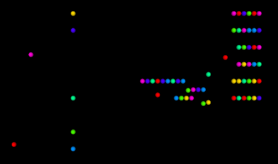

# SyDEVS

Multiscale Simulation and Systems Modeling Library

## About

The SyDEVS open source C++ library provides a framework for implementing complex systems analysis and simulation code in a modular, hierarchical fashion.

**In a nutshell, it will help make your simulation code scale.**

The framework combines 3 modeling paradigms: [discrete event simulation](https://en.wikipedia.org/wiki/Discrete_event_simulation), [dataflow programming](https://en.wikipedia.org/wiki/Dataflow_programming) and [agent-based modeling](https://en.wikipedia.org/wiki/Agent-based_model). These foundations give SyDEVS the generality needed to support essentially any type of simulation, regardless of domain, time scale, or time advancement scheme.

## Documentation

- [Overview](overview.html): Briefly introduces SyDEVS.
- [Getting Started](getting_started/): Explains how to use SyDEVS, step by step.
- [API Reference](doc/html/index.html): Documents the C++ classes that make up the library.
- SyDEVS Framework Overview ([PPTX](doc/downloads/SyDEVS_Framework_Overview.pptx), [PDF](doc/downloads/SyDEVS_Framework_Overview.pdf)): Illustrates the main concepts & relates them to code.
- SyDEVS Building7m Tutorial ([PPTX](doc/downloads/SyDEVS_Building7m_Tutorial.pptx), [PDF](doc/downloads/SyDEVS_Building7m_Tutorial.pdf)): Challenges users to learn by enhancing an example.

## Download

Download the latest SyDEVS release [here](https://github.com/Autodesk/sydevs/releases), or fork, clone, and build the [repo](https://github.com/Autodesk/sydevs).

You will need a C++ compiler that implements the C++14 standard. SyDEVS has been tested successfully with Visual Studio 2015, Visual Studio 2017, and recent versions of GCC and Clang.

SyDEVS is released under the [Apache License 2.0](https://github.com/Autodesk/sydevs/blob/master/LICENSE.md), a permissive open source license.

## Contact

Inquires about SyDEVS can be directed to [Rhys Goldstein](https://autodeskresearch.com/people/rhys-goldstein).

*Above: A queueing network simulated using SyDEVS*

