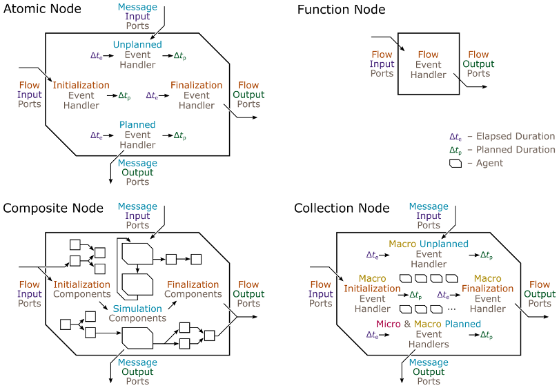

# Overview

Brief Introduction to SyDEVS

## Concept

Using SyDEVS, simulation code is organized into nodes, which can be linked together to form dataflow and simulation networks. There are four main types of nodes, illustrated below.



The ***atomic node*** provides a general structure for representing behavior that unfolds over simulated time. The modeler must implement four event handers that are invoked by the simulator. The initialization event hander is invoked first. The unplanned and planned event handlers are then called any number of times over the course of the simulation in response to incoming messages (unplanned events) or internally scheduled events (planned events). The finalization event handler is invoked at the end.

The ***function node*** represents a single function that reads a set of input values and calculates a set of output values.

The ***composite node*** integrates other nodes by linking their ports. There are initialization and finalization links, which form a dataflow programming graph. There are also simulation links, which direct messages and support discrete event simulation.

The ***collection node*** contains an arbtrary number of instances of the same type of node, supporting agent-based modeling.

## Example

Here's an example of a SyDEVS atomic node declared in C++. Observe that the four types of ports and four types of event handlers match the atomic node diagram above. The code is taken from the [queueing](https://github.com/Autodesk/sydevs/tree/master/src/examples/demo/queueing) demonstration project, which features an example of each of the four main types of nodes.

```cpp
/**
 * This node processes jobs one at a time. The time required to process a job
 * is determined by the service duration flow input. Any job that arrives while
 * another is being processed is placed in a queue and processed later. The
 * total time spend in an idle state, with no jobs to be processed, is tracked
 * and reported as a flow output.
 */
class queueing_node : public atomic_node
{
public:
    // Constructor/Destructor:
    queueing_node(const std::string& node_name, const node_context& external_context);
    virtual ~queueing_node() = default;

    // Attributes:
    virtual scale time_precision() const { return micro; }

    // Ports:
    port<flow, input, duration> serv_dt_input;    // service duration
    port<message, input, int64> job_id_input;     // job ID (input)
    port<message, output, int64> job_id_output;   // job ID (output)
    port<flow, output, duration> idle_dt_output;  // idle duration

protected:
    // State Variables:
    duration serv_dt;      // service duration (constant)
    std::vector<int64> Q;  // queue of IDs of jobs waiting to be processed
    duration idle_dt;      // idle duration (accumulating)
    duration planned_dt;   // planned duration

    // Event Handlers:
    virtual duration initialization_event();
    virtual duration unplanned_event(duration elapsed_dt);
    virtual duration planned_event(duration elapsed_dt);
    virtual void finalization_event(duration elapsed_dt);
};
```

For the complete implementation of this atomic node, see [queueing_node.h](https://github.com/Autodesk/sydevs/blob/master/src/examples/demo/queueing/queueing_node.h).

Also see an example of a function node ([plus_node.h](https://github.com/Autodesk/sydevs/blob/master/src/examples/demo/queueing/plus_node.h)), a composite node ([two_stage_queueing_node](https://github.com/Autodesk/sydevs/blob/master/src/examples/demo/queueing/two_stage_queueing_node.h)), and a collection node ([parallel_queueing_node.h](https://github.com/Autodesk/sydevs/blob/master/src/examples/demo/queueing/parallel_queueing_node.h)).

## Notable Features

- [Standard International (SI) Units](doc/html/classsydevs_1_1quantity.html#details): Quantities can be declared with SI units such as "kilograms" for mass and "meters per second squared" for acceleration. Operations and assignments involving these quantities are checked at compile-time to ensure the units match.
- [Multidimensional Arrays](doc/html/classsydevs_1_1arraynd.html#details): The SyDEVS library includes a generic multidimensional array class template supporting a range of numerical and slicing operations in C++, similar to [NumPy](http://www.numpy.org/) arrays in Python. See [lighting talk](https://www.youtube.com/watch?v=AX0BPjAvtCA&list=PL3X5olGbPMynKd3IhAFFfVE1sTyMS41pT) presented at C++ Toronto, November 2019.
- [Multiscale Representation of Simulated Time](http://journals.sagepub.com/eprint/mIKXDU2UtbJUjPZ8kupv/full): The following classes support the recording of past events and scheduling of future events involving any combination of time scales, yet store most event times internally using 64-bit numbers.
  - [quantity](https://autodesk.github.io/sydevs/doc/html/classsydevs_1_1quantity.html) (using the `duration = quantity<seconds>` type alias)
  - [time_point](https://autodesk.github.io/sydevs/doc/html/classsydevs_1_1time__point.html#details)
  - [time_sequence](https://autodesk.github.io/sydevs/doc/html/classsydevs_1_1time__sequence.html#details)
  - [time_queue](https://autodesk.github.io/sydevs/doc/html/classsydevs_1_1time__queue.html#details)
  - [time_cache](https://autodesk.github.io/sydevs/doc/html/classsydevs_1_1time__cache.html#details)

## Theoretical Basis

SyDEVS is heavily influenced by the [Discrete Event System Specification (DEVS)](https://en.wikipedia.org/wiki/DEVS), a set of conventions developed in the 1970s that allow essentially any simulation model to be specified using a common set of mathematical elements. The atomic and composite nodes of SyDEVS, which support [discrete event simulation](https://en.wikipedia.org/wiki/Discrete_event_simulation), are similar to the atomic and coupled models of the classic version of DEVS. The function nodes of SyDEVS extend the original theory to accommodate [dataflow programming](https://en.wikipedia.org/wiki/Dataflow_programming). The collection nodes improve support for [agent-based modeling](https://en.wikipedia.org/wiki/Agent-based_model).

## Related Articles

- [A Symmetric Formalism for Discrete Event Simulation with Agents](https://www.autodeskresearch.com/publications/symmetricformalism) by Goldstein et al., 2018 ([PDF](doc/downloads/Goldstein__Symmetric_Formalism__2018-08-03_1100.pdf)): This paper presents Symmetric DEVS, the variant of DEVS on which SyDEVS is based. Symmetric DEVS extends discrete event simulation with elements of dataflow programming and agent-based modeling. Also see *Agent-Based Modeling with Symmetric DEVS* ([PPTX](doc/downloads/AgentBasedSyDEVS_Tutorial.pptx)), a tutorial on the Symmetric DEVS formalism.
- [Multiscale Representation of Simulated Time](https://autodeskresearch.com/publications/multiscale-representation-simulated-time) by Goldstein et al., 2017 ([PDF](doc/downloads/Goldstein__Multiscale_Time__2017-09-05.pdf)): Standard representations of time based on integers or floating-point numbers have serious drawbacks that limit the ability of most frameworks to handle models with dramatically different timescales. The multiscale time representation proposed in this paper is implemented in SyDEVS, allowing models with varying levels of time precision to coexist while keeping rounding errors bounded.
- [Designing DEVS Visual Interfaces for End-User Programmers](https://autodeskresearch.com/publications/designingdevs) by Maleki et al., 2015 ([PDF](doc/downloads/Maleki__Designing_DEVS__2015-08-13.pdf)): SyDEVS is largely based on the visual programming interfaces proposed in this paper. Although there is currently no graphical modeling tool accompanying the framework, the same node-based models presented visually in the paper can be implemented directly in C++ using the SyDEVS library. Also, the manner in which DEVS is expressed in SyDEVS is largely based on the conventions and terminology proposed in the paper.
- [The Future of Designing Systems](https://autodeskresearch.com/blog/future-designing-systems) by Rhys Goldstein, 2016: This blog post describes the motivation behind frameworks like SyDEVS, focusing on the design of buildings as systems involving people, controls, and environmental conditions.

## Other DEVS Frameworks

- [Adevs](https://web.ornl.gov/~nutarojj/adevs/) (C++) developed at Oak Ridge National Laboratory
- [CD++](http://cell-devs.sce.carleton.ca/mediawiki/index.php/Main_Page) (C++) by the [ARSLab](http://cell-devs.sce.carleton.ca/ars/) at Carleton University
- [CoSMoS](https://acims.asu.edu/software/cosmos/) (Java) by the [ACIMS](https://acims.asu.edu/) at Arizona State University
- [DesignDEVS](http://simaud.org/resources.php#software) (Lua) by [Autodesk Research](https://autodeskresearch.com/)
- [DEVS-Ruby](https://github.com/devs-ruby/devs) (Ruby) developed at the University of Corsica
- [James II](http://jamesii.informatik.uni-rostock.de/jamesii.org/) (Java) by the [Modeling and Simulation Group](https://mosi.informatik.uni-rostock.de/) at the University of Rostock
- [MS4 Me](http://www.ms4systems.com/pages/ms4me.php) (Java) by [MS4 Systems](http://www.ms4systems.com/pages/main.php)
- [PowerDEVS](https://sourceforge.net/projects/powerdevs/) (C++) developed at the National University of Rosario
- [PythonPDEVS](http://msdl.cs.mcgill.ca/projects/DEVS/PythonPDEVS) (Python) by the [MSDL](http://msdl.cs.mcgill.ca/) (McGill University) and [AnSyMo](https://www.uantwerpen.be/en/research-groups/nexor/team/ansymo/) (University of Antwerp)
- [Virtual Laboratory Environment](http://www.vle-project.org/) (C++)
- [XSY](https://code.google.com/archive/p/x-s-y/) (Python)
