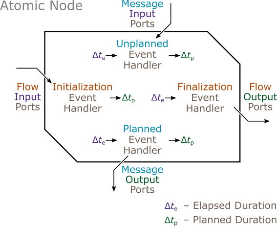

| [Prev](index.html) | [User Manual -- Table of Contents](index.html) | [Next](function_nodes.html) |
# Atomic Nodes

The ***atomic node*** provides a general structure for representing behavior that unfolds over simulated time. The modeler must implement four event handers that are invoked by the simulator. The initialization event hander is invoked first. The unplanned and planned event handlers are then called any number of times over the course of the simulation in response to incoming messages (unplanned events) or internally scheduled events (planned events). The finalization event handler is invoked at the end.



The atomic node base class is defined in [atomic_node.h](https://github.com/Autodesk/sydevs/blob/master/src/sydevs/systems/atomic_node.h), which must be included by all atomic nodes.

```cpp
#include <sydevs/systems/atomic_node.h>
```

## Example Declarations

An example of an atomic node is the `queueing_node` class found in [queueing_node.h](https://github.com/Autodesk/sydevs/blob/master/src/examples/demo/queueing/queueing_node.h), which is part of the [queueing](https://github.com/Autodesk/sydevs/tree/master/src/examples/demo/queueing) demonstration project. Below is the class declaration, which inherits from `atomic_node`.

```cpp
/**
 * This node processes jobs one at a time. The time required to process a job
 * is determined by the service duration flow input. Any job that arrives while
 * another is being processed is placed in a queue and processed later. The
 * total time spend in an idle state, with no jobs to be processed, is tracked
 * and reported as a flow output.
 */
class queueing_node : public atomic_node
{
public:
    // Constructor/Destructor:
    queueing_node(const std::string& node_name, const node_context& external_context);
    virtual ~queueing_node() = default;

    // Attributes:
    virtual scale time_precision() const { return micro; }

    // Ports:
    port<flow, input, duration> serv_dt_input;    // service duration
    port<message, input, int64> job_id_input;     // job ID (input)
    port<message, output, int64> job_id_output;   // job ID (output)
    port<flow, output, duration> idle_dt_output;  // idle duration

protected:
    // State Variables:
    duration serv_dt;      // service duration (constant)
    std::vector<int64> Q;  // queue of IDs of jobs waiting to be processed
    duration idle_dt;      // idle duration (accumulating)
    duration planned_dt;   // planned duration

    // Event Handlers:
    virtual duration initialization_event();
    virtual duration unplanned_event(duration elapsed_dt);
    virtual duration planned_event(duration elapsed_dt);
    virtual void finalization_event(duration elapsed_dt);
};
```

## Constructor/Destructor Declarations

The following constructor and destructor public declarations should appear for all types of nodes, except that the name `queueing_node` must of course be replaced with the name of the node being specified.

```cpp
    queueing_node(const std::string& node_name, const node_context& external_context);
    virtual ~queueing_node() = default;
```

By convention, nodes with ports have names that end in `_node`, and nodes with no ports usually have names that end in `_closed_system`.

## Attributes

Atomic nodes must override the pure virtual member function `time_precision()`, as in the `queueing_node` example:

```cpp
    virtual scale time_precision() const { return micro; }
```

The function should return one of the following `scale` values:

```cpp
yocto  // scale(-8);
zepto  // scale(-7);
atto   // scale(-6);
femto  // scale(-5);
pico   // scale(-4);
nano   // scale(-3);
micro  // scale(-2);
milli  // scale(-1);
unit   // scale(0);
kilo   // scale(1);
mega   // scale(2);
giga   // scale(3);
tera   // scale(4);
peta   // scale(5);
exa    // scale(6);
zetta  // scale(7);
yotta  // scale(8);
```

This attribute is the precision level to which all elapsed durations will be rounded by the simulator, and to which all planned duration must be rounded by the modeler. For example, if an atomic node has a time precision of microseconds (`micro`), and if any of the atomic node's event handlers return a more fine-grained planned duration of 17 nanoseconds,(`17_ns`), an exception will be thrown.

When choosing a time precision, a convenient rule of thumb is to estimate the time scale of the model, divide by one million, and round down. So if the time scale is estimated to be 5 seconds, then the precision should be `micro`. Note that if the precision level is too coarse, large rounding errors will occur in the timing of events. But if the precision level is too fine, then the upper bound of 1,000,000,000,000,000 time quanta will limit the range of the duration values on which the node depends. For example, if a node's time precision is nanoseconds, then its duration values must be less than 1,000,000,000,000,000 nanoseconds (or one million seconds) in magnitude.

Different nodes can have different levels of time precision, and can be integrated regardless of much these precision levels diverge. Also, the total duration of a simulation run is always unlimited. See [this journal paper](http://journals.sagepub.com/eprint/mIKXDU2UtbJUjPZ8kupv/full) for more information on the multiscale time represetation that makes this possible.

## Ports

Ports are the primary means by which a SyDEVS node interacts with external entities. There are four types of ports: flow input ports, which take in parameters during initialization; message input ports, which receive messages during unplanned events; message output ports, which send messages during planned events; and flow output ports, which give out statistics during finalization. The [queueing_node.h](https://github.com/Autodesk/sydevs/blob/master/src/examples/demo/queueing/queueing_node.h) example has one port of each type.

```cpp
    port<flow, input, duration> serv_dt_input;    // service duration
    port<message, input, int64> job_id_input;     // job ID (input)
    port<message, output, int64> job_id_output;   // job ID (output)
    port<flow, output, duration> idle_dt_output;  // idle duration
```

Ports are declared in essentially the same manner regardless of whether the node is an atomic node, a function node (flow ports only), a composite node, or a collection node. It is possible for a node to have more than one port of the same type, and no ports of a different type. The composite node [building_dynamics_node.h](https://github.com/Autodesk/sydevs/blob/master/src/examples/demo/building7m/building_dynamics_node.h), from the [building7m](https://github.com/Autodesk/sydevs/tree/master/src/examples/demo/building7m) project, has 5 flow input ports, 2 message output ports, and no ports of the other two types, as can be seen below.

```cpp
    port<flow, input, thermodynamic_temperature> initial_temperature_input;
    port<flow, input, std::pair<array2d<int64>, distance>> building_layout_input;
    port<flow, input, float64> wall_resistance_input;
    port<flow, input, array1d<int64>> initial_position_input;
    port<flow, input, quantity<decltype(_m/_s)>> walking_speed_input;
    port<message, output, array2d<thermodynamic_temperature>> temperature_field_output;
    port<message, output, array1d<int64>> occupant_position_output;
```

By convention, flow input and message input ports usually have names that end in `_input`, and message output and flow output ports have names that end in `_output`. Ports are declared in the public section of a node, ensuring that they can be referenced by the encompassing node. 

Note that every port has a data type, which must be a SyDEVS qualified type. The library includes a set of core types that are qualified by default. These are listed below.

```cpp
bool         // boolean, `true` or `false`
int64        // 64-bit signed integer
float64      // 64-bit floating-point number (`double`)
std::string  // standard library string

quantity<U>        // base-1000 amount of any Standard International (SI) unit `U`
identity<U>        // encapsulated 64-bit integer with a generic unit `U`
arraynd<T, ndims>  // multidimensional array of data type `T` and `ndims` dimensions

std::pair<T1, T2>  // standard library pair of values of data types `T1` and `T2`
std::tuple<...>    // standard library tuple of values of the specified data types
std::vector<T>     // standard library vector of values of data type `T`
std::set<T>        // standard library set of values of data type `T`
std::map<T>        // standard library map of values of data type `T`

std::shared_ptr<T>  // standard library shared pointer to value of data type `T`
```

The first 4 qualified types are standard C++ data types.

The next 3 qualified types are elements of the SyDEVS library. See the [quantity](https://autodesk.github.io/sydevs/doc/html/classsydevs_1_1quantity.html#details), [identity](https://autodesk.github.io/sydevs/doc/html/classsydevs_1_1identity.html#details), and [arraynd](https://autodesk.github.io/sydevs/doc/html/classsydevs_1_1arraynd.html#details) class references for more details.

Some of the qualified types include a template parameter specifying another data type (`T`, `T1`, `T2`). These data types must also be qualified types, with one exception. The exception is `std::shared_ptr<T>`, for which `T` can be any C++ data type. The catch is that `std::shared_ptr<T>` will transfer data by reference instead of performing a deep copy. If a reference is passed between nodes, it may introduce a communication channel that bypasses the nodes' ports. This can lead to bugs.

Any C++ type can be turned into a qualified type by specializing the `qualified_type` trait class. The technique is non-invasive in that the original C++ type does not have to be modified. For a demonstration, see [data_custom_node.h](https://github.com/Autodesk/sydevs/blob/master/src/examples/test_systems/data/data_custom_node.h) where a user-defined class named `foo` is turned into a qualified type by defining the specialization `sydevs::qualified_type<foo>`.

## State Variables

Atomic node state variables are just regular C++ member variables.

Below are the state variables declared in [queueing_node.h](https://github.com/Autodesk/sydevs/blob/master/src/examples/demo/queueing/queueing_node.h).

```cpp
    duration serv_dt;      // service duration (constant)
    std::vector<int64> Q;  // queue of IDs of jobs waiting to be processed
    duration idle_dt;      // idle duration (accumulating)
    duration planned_dt;   // planned duration
```

A state variable's data type does not have to be a qualified type. However, using qualified types for state variables may make the variables more consistent with port values. Also, instances of qualified types are convenient to work with because they can be converted to strings or printed using the functions below.

```cpp
std::string tostring(const T& X)  // converts X to a string
print(const T& X)                 // prints X along with the simulation time and node ID
```

Whenever appropriate, the SyDEVS convention is to assign initial values to state variables in the `initialization_event` event handler instead of the constructor.

## Constructor Definitions

The constructor of an atomic node is generally used only to initialize the base class (`atomic_node`) and the ports. The ports are initialized with two arguments: a name (e.g. `"serv_dt_input"`), which by convention matches the name of the member variable (e.g. `serv_dt_input`); and the `external_interface()` object, which associates them with the external interface of the node.

Below is the constructor definition for [queueing_node.h](https://github.com/Autodesk/sydevs/blob/master/src/examples/demo/queueing/queueing_node.h).

```cpp
inline queueing_node::queueing_node(const std::string& node_name, const node_context& external_context)
    : atomic_node(node_name, external_context)
    , serv_dt_input("serv_dt_input", external_interface())
    , job_id_input("job_id_input", external_interface())
    , job_id_output("job_id_output", external_interface())
    , idle_dt_output("idle_dt_output", external_interface())
{
}
```

## Event Handlers

Atomic nodes must override the four pure virtual member functions representing each of the four types of event handlers. These functions are declared as follows:

```cpp
    virtual duration initialization_event();
    virtual duration unplanned_event(duration elapsed_dt);
    virtual duration planned_event(duration elapsed_dt);
    virtual void finalization_event(duration elapsed_dt);
```

### Initialization Events

The `initialization_event` function is invoked once, before any other event handling function. Typically it is invoked at the beginning of the simulation (unless the node is an agent; see [Collection Nodes](collection_nodes.html)). The main purpose of the function is to take parameter values from the flow input ports, and use the information to initialize the state variables. The return value is the planned duration until the next planned event.

Flow input port values are obtained using the port member function `value`, which returns a value with a data type matching the port's declaration. If the port value is of data type `duration`, it is conventional to invoke `.fixed_at(time_precision())` on the value to ensure subsequent operations remain at the node's specified level of time precision. This minimizes the chance of triggering an error by returning a planned duration with an excessively fine precision.

Below is the initialization event handler from [queueing_node.h](https://github.com/Autodesk/sydevs/blob/master/src/examples/demo/queueing/queueing_node.h).

```cpp
inline duration queueing_node::initialization_event()
{
    // Initialize the service duration from the flow input port, and fix the
    // time precision level at that of the node (a recommended practice).
    serv_dt = serv_dt_input.value().fixed_at(time_precision());  

    // Initialize the empty queue and accumulated idle time.
    Q = std::vector<int64>();
    idle_dt = 0_s;

    // Wait indefinitely for a message input (unplanned event) or the end of
    // the simulation (finalization event).
    planned_dt = duration::inf();
    return planned_dt;
}
```

### Unplanned Events

The `unplanned_event` function is invoked every time a message is received. The node does not know when it will receive a message; hence these events are "unplanned". The fact a node must always be ready for an incoming message is one of the distinguishing characteristics of DEVS. Unplanned event handlers are invoked by the simulator with the elapsed duration `elapsed_dt`, the duration since the previous event of any type. The return value is the planned duration until the next planned event.

Inside the function, there is usually an `if`...`else if` structure that checks which message input port is the one that received the message. The message value is then extracted from that port. These operations make use of the bool-valued port member function `received`, and the port member function `value`.

Below is the unplanned event handler from [queueing_node.h](https://github.com/Autodesk/sydevs/blob/master/src/examples/demo/queueing/queueing_node.h).

```cpp
inline duration queueing_node::unplanned_event(duration elapsed_dt)
{
    // If the queue is empty, record the elapsed duration as idle time.
    if (Q.empty()) {
        idle_dt += elapsed_dt;
    }

    // Handle the message input.
    if (job_id_input.received()) {
        // Get the received job ID
        int64 job_id = job_id_input.value();

        // Add the job ID to the queue.
        Q.push_back(job_id);

        // If the only queued job is the one just added, process it for the
        // service duration; otherwise continue processing a preexisting job
        // for the same duration as before minus the elapsed duration.
        if (Q.size() == 1) {
            planned_dt = serv_dt;
        }
        else {
            planned_dt -= elapsed_dt;
        }
    }

    // Schedule a planned event when the job at the front of the queue is
    // processed.
    return planned_dt;
}
```

### Planned Events

The `planned_event` function is invoked whenever the planned duration elapses without being interrupted by an unplanned event. If a message is received either before the planned duration elapses or at the same time, then the planned event is essentially cancelled and the unplanned event occurs instead. (The instruction `planned_dt -= elapsed_dt` is often used to reschedule the planned event, as in the example above.) Like its unplanned counterpart, the planned event handler is invoked with the elapsed duration `elapsed_dt` and returns the planned duration until the next planned event.

Inside the function, there is often (but not necessarily) one or more instructions to send a message on a message output port. These operations make use of the port member function `send`. It is possible to send multiple messages on the same port, or multiple messages on multiple ports. Even if multiple messages are sent from the same planned event, each message triggers its own separate unplanned event in each receiving node.

Below is the planned event handler from [queueing_node.h](https://github.com/Autodesk/sydevs/blob/master/src/examples/demo/queueing/queueing_node.h).

```cpp
inline duration queueing_node::planned_event(duration elapsed_dt)
{
    // The first job in the queue has been processed, so send the ID as a
    // message output and remove it from the queue.
    int64 job_id = Q[0];
    job_id_output.send(job_id);
    Q.erase(std::begin(Q));

    // If the queue is now empty, wait indefinitely; otherwise process the next
    // job for the service duration.
    if (Q.empty()) {
        planned_dt = duration::inf();
    }
    else {
        planned_dt = serv_dt;
    }
    return planned_dt;
}
```

### Finalization Events

The `finalization_event` function is invoked once, after all other events. Typically it is invoked at the end of the simulation (unless the node is an agent; see [Collection Nodes](collection_nodes.html)). The main purpose of the function is to assign statistic values to all the flow output ports. These statistic values sometimes depend on the elapsed duration, which is available as an argument.

Flow output port values are assigned using the port member function `assign`.

Below is the finalization event handler from [queueing_node.h](https://github.com/Autodesk/sydevs/blob/master/src/examples/demo/queueing/queueing_node.h).

```cpp
inline void queueing_node::finalization_event(duration elapsed_dt)
{
    // If the queue is empty, record the elapsed duration as idle time.
    if (Q.empty()) {
        idle_dt += elapsed_dt;
    }

    // Assign the accumulated idle time to the flow output port.
    idle_dt_output.assign(idle_dt);
}
```

## More Examples

The examples below are from the [building7m](https://github.com/Autodesk/sydevs/tree/master/src/examples/demo/building7m) demonstration project.

The `weather_node` class found in [weather_node_node.h](https://github.com/Autodesk/sydevs/blob/master/src/examples/demo/building7m/weather_node.h) performs a simple numerical integration using a fixed time step.

The `thermodynamics_node` class found in [thermodynamics_node.h](https://github.com/Autodesk/sydevs/blob/master/src/examples/demo/building7m/thermodynamics_node.h) is an example of an atomic node that maintains a fixed time step between output messages regardless of when it receives input messages.

The `occupant_node` class found in [occupant_node.h](https://github.com/Autodesk/sydevs/blob/master/src/examples/demo/building7m/occupant_node.h) provides an example of stocasticity, where a simulated individual performs a random walk within a building.

| [***Continue to Function Nodes***](function_nodes.html) |

