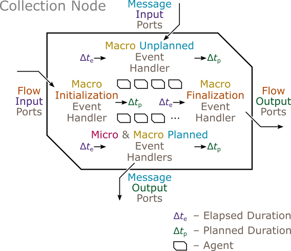

| [Prev](composite_nodes.html) | [User Manual -- Table of Contents](index.html) | [Next](simulations.html) |
# Collection Nodes

The ***collection node*** contains an arbtrary number of instances of the same type of node, supporting agent-based modeling.

The collection node source code can be found in [collection_node.h](https://github.com/Autodesk/sydevs/blob/master/src/sydevs/systems/collection_node.h).

***DETAILS COMING SOON...***

| [***Continue to Simulations***](simulations.html) |