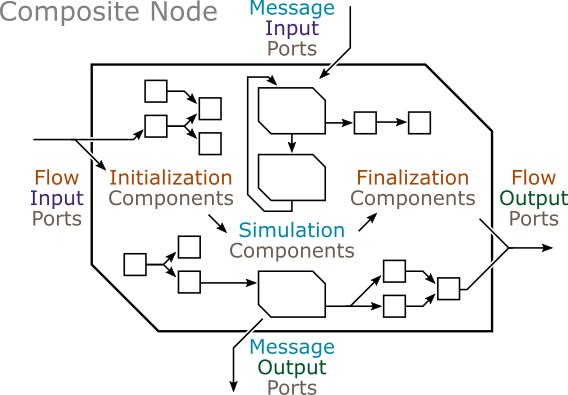

| [Prev](function_nodes.html) | [User Manual -- Table of Contents](index.html) | [Next](collection_nodes.html) |
# Composite Nodes

The ***composite node*** integrates other nodes by linking their ports. There are initialization and finalization links, which form a dataflow programming graph. There are also simulation links, which direct messages and support discrete event simulation.



The composite node base class is defined in [composite_node.h](https://github.com/Autodesk/sydevs/blob/master/src/sydevs/systems/composite_node.h), which must be included by all composite nodes.

```cpp
#include <sydevs/systems/composite_node.h>
```

## Sample Declarations

An example of a composite node is the `two_stage_queueing_node` class found in [two_stage_queueing_node.h](https://github.com/Autodesk/sydevs/blob/master/src/examples/demo/queueing/two_stage_queueing_node.h), which is part of the [queueing](https://github.com/Autodesk/sydevs/tree/master/src/examples/demo/queueing) demonstration project. Below is the class declaration, which inherits from `composite_node`.

```cpp
/**
 * This node places two queueing nodes end-on-end, so that incoming jobs must
 * pass through two queues in order to be processed. The idle duration of this
 * composite node is the sum of the idle durations of the two queueing nodes.
 */
class two_stage_queueing_node : public composite_node
{
public:
    // Constructor/Destructor:
    two_stage_queueing_node(const std::string& node_name, const node_context& external_context);
    virtual ~two_stage_queueing_node() = default;

    // Ports:
    port<flow, input, duration> serv_dt_input;    // service duration
    port<message, input, int64> job_id_input;     // job ID (input)
    port<message, output, int64> job_id_output;   // job ID (output)
    port<flow, output, duration> idle_dt_output;  // idle duration

    // Components:
    queueing_node queue_A;     // node representing the 1st stage (queue A)
    queueing_node queue_B;     // node representing the 2nd stage (queue B)
    plus_node<duration> plus;  // node adding the idle times of both queues A and B
};
```

## Constructor/Destructor Declarations

Constructors and destructor declarations are the same for all types of nodes (see [Atomic Nodes -- Constructor/Destructor Declarations](atomic_nodes.html#constructordestructor-declarations)).

## Ports

Ports are the same as for atomic and collection nodes (see [Atomic Nodes -- Ports](atomic_nodes.html#ports)). However, it is important to remember that the ports declared in a composite node refer to the external ports of its external interface, not the ports of its components.

## Components

The components of a composite node are themselves nodes of any type, including other composite nodes. The nesting of composite nodes allows models to be developed in a hierarchical fashion. Components are declared in the public section of the composite node to ensure the entire hierarchy is accessible for debugging purposes.

The `two_stage_queueing_node` in [two_stage_queueing_node.h](https://github.com/Autodesk/sydevs/blob/master/src/examples/demo/queueing/two_stage_queueing_node.h) has three components, declared as follows.

```cpp
    queueing_node queue_A;     // node representing the 1st stage (queue A)
    queueing_node queue_B;     // node representing the 2nd stage (queue B)
    plus_node<duration> plus;  // node adding the idle times of both queues A and B
```

Note that if two nodes are scheduled to undergo events at the same time, the component declared above the other will have its event occur first. In some cases this may cause the other node's event not to occur at all.

## Constructor Definitions

The constructor of a composite node initializes both its external ports and its components, and specifies the links that connect all of the ports including the ports of the components. 

External ports are initialized with a name and the `external_interface()` object, similar to atomic nodes (see [Atomic Nodes -- Constructor Definitions](atomic_nodes.html#constructor-definitions)). 

Components are initialized with a name and the `internal_context()` object, which associates them with the internal composition of the node.

There are three types of links. Inward links, defined using the `inward_link` function, go from one of the composite node's external input ports to one of its component's input ports. Inner links, defined using the `inner_link` function, go from a component output port to a component input port. Outward links, defined using the `outward_link` function, go from a component output port to one of the composite node's external output ports.

When connecting two ports via any type of link, the data type associated with both ports must match. Links direct values of the specified data type from the first port to the second.

Below is the constructor definition from [two_stage_queueing_node.h](https://github.com/Autodesk/sydevs/blob/master/src/examples/demo/queueing/two_stage_queueing_node.h).

```cpp
two_stage_queueing_node::two_stage_queueing_node(const std::string& node_name, const node_context& external_context)
    : composite_node(node_name, external_context)
    , serv_dt_input("serv_dt_input", external_interface())
    , job_id_input("job_id_input", external_interface())
    , job_id_output("job_id_output", external_interface())
    , idle_dt_output("idle_dt_output", external_interface())
    , queue_A("queue_A", internal_context())
    , queue_B("queue_B", internal_context())
    , plus("plus", internal_context())
{
    // Flow Input Links:
    inward_link(serv_dt_input, queue_A.serv_dt_input);
    inward_link(serv_dt_input, queue_B.serv_dt_input);

    // Flow Micro Links:
    inner_link(queue_A.idle_dt_output, plus.a_input);
    inner_link(queue_B.idle_dt_output, plus.b_input);

    // Flow Output Links:
    outward_link(plus.c_output, idle_dt_output);

    // Message Input Links:
    inward_link(job_id_input, queue_A.job_id_input);

    // Message Micro Links:
    inner_link(queue_A.job_id_output, queue_B.job_id_input);

    // Message Output Links:
    outward_link(queue_B.job_id_output, job_id_output);
}
```

## Parameter and Statistic Nodes

Parameter and statistic nodes are a special type of function node designed to provide a convenient way to handle parameters and statistics in the context of a composite node. Parameter nodes, which supply values to a simulation, are defined in [parameter_node.h](https://github.com/Autodesk/sydevs/blob/master/src/sydevs/systems/parameter_node.h). Statistics nodes, which extract values from a simulation, are defined in [statistic_node.h](https://github.com/Autodesk/sydevs/blob/master/src/sydevs/systems/statistic_node.h). These header files can be included as follows.

```cpp
#include <sydevs/systems/parameter_node.h>
#include <sydevs/systems/statistic_node.h>
```

Parameter and statistic nodes are declared as components.

```cpp
    parameter_node<int64> number_of_apples;
    parameter_node<duration> service_dt;
    statistic_node<float64> percent_growth;
```

They are initialized in the same manner as other types of components, except that parameter nodes allow a default value to be specified as the third argument.

```cpp
    , number_of_apples("number_of_apples", internal_context())
    , service_dt("service_dt", internal_context(), 17500_ms)
    , percent_growth("percent_growth", internal_context())
```

Parameter and statistic nodes have a port of the same name (i.e. `parameter` or `statistic`) that can be connected to other nodes via inner links.

```cpp
    inner_link(number_of_apples.parameter, other_node.number_of_apples);
    inner_link(service_dt.parameter, other_node.service_dt);
    inner_link(other_node.percent_growth, percent_growth.statistic);
```
 
| [***Continue to Collection Nodes***](collection_nodes.html) |